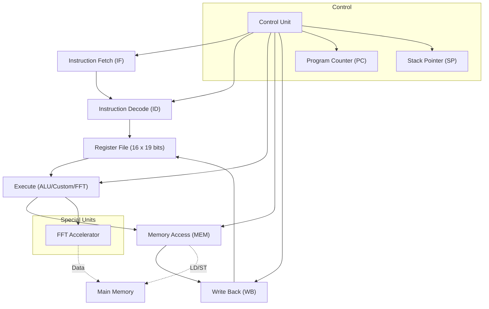

# 19-bit Signal Processing CPU — Documentation

---

## 1. Introduction
This project implements a custom 19-bit CPU architecture specialized for signal processing applications. The CPU features a unique 19-bit instruction width, a 5-stage pipeline, and custom instructions such as FFT to accelerate common signal processing tasks.

---

## 2. CPU Architecture Overview

**Block Diagram:**

**Pipeline Stages:**
- IF (Instruction Fetch)
- ID (Instruction Decode)
- EX (Execute/ALU/FFT)
- MEM (Memory Access)
- WB (Write Back)

**Main Components:**
- Register File (16 x 19 bits)
- ALU
- FFT Accelerator
- Control Unit
- Memory Interface
- Program Counter (PC), Stack Pointer (SP)

---

## 3. Instruction Format

### R-type (Register-Register)
| Field      | Bits | Description                        |
|------------|------|------------------------------------|
| Opcode     | 5    | Operation code (up to 32 ops)      |
| Dest (rd)  | 4    | Destination register (0-15)        |
| Src1 (rs1) | 4    | Source register 1 (0-15)           |
| Src2 (rs2) | 4    | Source register 2 (0-15)           |
| Unused     | 2    | Reserved                           |

### I-type (Register + Immediate/Address)
| Field      | Bits | Description                        |
|------------|------|------------------------------------|
| Opcode     | 5    | Operation code                     |
| Dest (rd)  | 4    | Register (or source/dest)          |
| Address/Imm| 10   | Address or immediate value         |

### J-type (Jump/Call)
| Field      | Bits | Description                        |
|------------|------|------------------------------------|
| Opcode     | 5    | Operation code                     |
| Address    | 14   | Jump/Call address                  |

### Special (RET, NOP, etc.)
| Field      | Bits | Description                        |
|------------|------|------------------------------------|
| Opcode     | 5    | Operation code                     |
| Unused     | 14   | Reserved                           |

---

## 4. Instruction Set Table
| Opcode (bin) | Mnemonic | Type | Description |
|--------------|----------|------|-------------|
| 00000        | ADD      | R    | r1 = r2 + r3 |
| 00001        | SUB      | R    | r1 = r2 - r3 |
| 00010        | MUL      | R    | r1 = r2 * r3 |
| 00011        | DIV      | R    | r1 = r2 / r3 |
| 00100        | INC      | I    | r1 = r1 + 1  |
| 00101        | DEC      | I    | r1 = r1 - 1  |
| 00110        | AND      | R    | r1 = r2 & r3 |
| 00111        | OR       | R    | r1 = r2 | r3 |
| 01000        | XOR      | R    | r1 = r2 ^ r3 |
| 01001        | NOT      | I    | r1 = ~r2     |
| 01010        | JMP      | J    | PC = addr    |
| 01011        | BEQ      | I    | if(r1==r2) PC=addr |
| 01100        | BNE      | I    | if(r1!=r2) PC=addr |
| 01101        | CALL     | J    | Call subroutine |
| 01110        | RET      | S    | Return from subroutine |
| 01111        | LD       | I    | r1 = mem[addr] |
| 10000        | ST       | I    | mem[addr] = r1 |
| 10001        | FFT      | I    | FFT(mem[r2]), store at mem[r1] |
| 10010        | ENC      | I    | Encrypt(mem[r2]), store at mem[r1] |
| 10011        | DEC      | I    | Decrypt(mem[r2]), store at mem[r1] |

---

## 5. Module Descriptions

**Register File:**
- 16 registers, 19 bits each, dual-read, single-write

**ALU:**
- Supports ADD, SUB, MUL, DIV, AND, OR, XOR, NOT, INC, DEC

**Control Unit:**
- Decodes 19-bit instructions into opcode, register addresses, immediate, and address fields

**FFT Accelerator:**
- Custom instruction for Fast Fourier Transform on memory blocks

**Memory Interface:**
- 1K x 19-bit memory, read/write logic

**Top-Level CPU:**
- Connects all modules, manages pipeline (placeholders for now)

---

## 6. Custom Instructions for Signal Processing
- **FFT:** Performs Fast Fourier Transform on data in memory, stores result at specified address
- **ENC/DEC:** (Optional) Encrypts/Decrypts data blocks in memory

---

## 7. Design Choices
- **19 bits:** Chosen for uniqueness and to demonstrate custom instruction encoding
- **16 registers:** Balances hardware complexity and performance
- **Pipeline:** 5-stage pipeline for efficient instruction throughput
- **Specialization:** FFT and other custom instructions accelerate signal processing workloads

---

## 8. How to Build and Simulate
- **Files:**
  - cpu19.v (top-level)
  - regfile.v
  - alu.v
  - control_unit.v
  - fft_accel.v
  - mem_interface.v
- **Simulation:**
  - Use any Verilog simulator (e.g., Icarus Verilog, ModelSim)
  - (Optional) Write testbenches for ALU, register file, or top-level CPU

---

## 9. Screen Recording Link
- [Insert your Google Drive link here]

---

## 10. Conclusion
This project demonstrates a custom 19-bit CPU architecture tailored for signal processing, with a flexible instruction set and modular Verilog implementation. The design can be extended with more custom instructions or optimized pipeline stages for further performance improvements. 